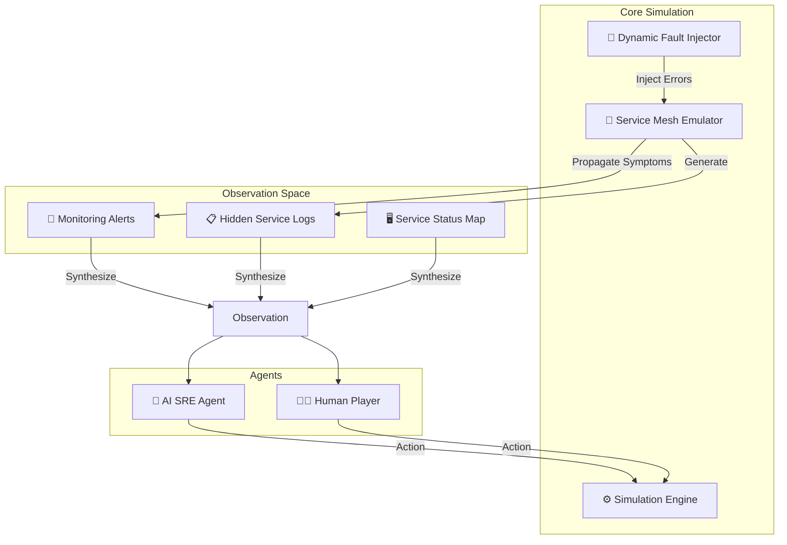

# 🚨 PagerSim-OpenEnv

**High-Fidelity SRE Incident Response Simulation for AI Agent Training**

[](https://huggingface.co/spaces/Kurru/pagersim-openenv)
[](https://metapytorch.devpost.com/)
[](https://www.python.org)

PagerSim-OpenEnv is a specialized environment for training and benchmarking AI agents on **Operational Site Reliability Engineering (SRE)** tasks. It simulates a production microservices environment undergoing various failures, requiring agents to investigate, diagnose, and resolve incidents just like a human engineer on-call.

---

## 🏗️ System Architecture

PagerSim-OpenEnv is built on a custom simulation engine that recreates the complexities of service dependencies and cascading failures.



---

## 🎯 Key Features

- **Novel Context**: OpenEnv environment dedicated to DevOps and SRE operations.
- **Cascading Failures**: Supports complex scenarios where the alerting service is a victim of a dependency failure.
- **Dense Shaped Rewards**: Agents are rewarded for logical investigation steps, not just the final fix.
- **Dual Mode**: Includes both an autonomous AI Agent playground and an interactive "Human Play" mode for benchmarking.
- **Standardized Inference**: Fully compliant with the Meta PyTorch OpenEnv submission checklist.

---

## 📂 Environment Specification

### Observation Space
The observation is a structured JSON containing:
- **Incident Metadata**: ID, Task ID, Time limits.
- **Alerts**: Real-time critical/high/medium severity alerts.
- **Logs**: Service-specific logs (revealed only upon investigation).
- **Service Status**: Binary state (UP/DOWN/DEGRADED) for all mesh services.

### Action Space
| Action | Description |
|---|---|
| `investigate_service` | Unlocks detailed logs for a specific service. |
| `check_dependencies` | Reveals the upstream/downstream relationships. |
| `restart_service` | Standard recovery action for memory leaks/hung processes. |
| `rollback_deployment` | Reverts recent code changes (fixes deployment bugs). |
| `write_postmortem` | Required to document the root cause and prevention plan. |
| `declare_resolved` | Ends the episode; successful only if the fix is verified. |

---

## 🏆 Scoring & Rewards

Maximum score is **1.0**. Rewards are "shaped" to encourage proper SRE methodology:

| Step Type | Reward | Why? |
|---|---|---|
| **Investigation** | +0.15 | Correctly identifying the source of logs. |
| **Dependency Check** | +0.10 | Understanding the topology before acting. |
| **Remediation** | +0.20 | Applying the correct fix (Restart vs. Rollback). |
| **Postmortem** | +0.35 | Correct root cause identification and quality. |
| **Resolution** | +0.25 | Successfully ending a resolved incident. |

---

## 🚀 Quick Start

### Local Setup
```bash
git clone https://huggingface.co/spaces/Kurru/pagersim-openenv
cd pagersim-openenv
pip install -r requirements.txt
python3 -m uvicorn api.server:app --port 7860
```

### Running Inference
Ensure you have your API keys set:
```bash
export API_BASE_URL="https://api.openai.com/v1"
export MODEL_NAME="gpt-4o-mini"
export HF_TOKEN="your-api-key"
python3 inference.py
```

---

## 🛠️ Tasks & Challenges

1.  **Easy: Database Overload**: Connection pool exhaustion requires identifying the saturating service.
2.  **Medium: Cascading Auth Failure**: A memory leak in a core service causes upstream timeouts.
3.  **Hard: Rate Limiter Poisoning**: A configuration error throttles production traffic; a recent deployment is a red herring.

